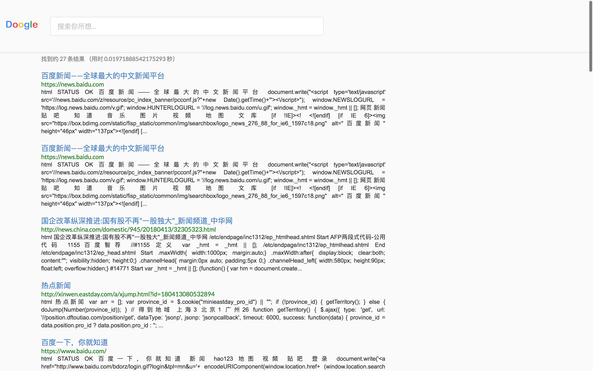

# Doogle
a tiny-size search engine, just a bravo try, linking crawler
, django, models together.

## Have Fun :> 

Try to start the django project, and add the `search\` to the 
origin url, your window href will be redirected to this one.

Try to search news, and this is the final result

Due to knowledge of database and server, more web hrefs should 
be included in the future(some day). And display text should be more 
clean without html codes. 